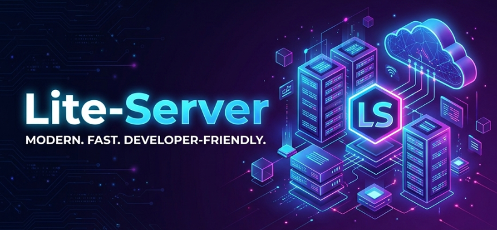

<div align="center">
  
  
  # Lite-Server 🚀
  
  **A modern, lightweight, and extensible file platform built with TypeScript & Node.js.**
  
  [](LICENSE)
  [](https://nodejs.org)
  [](https://www.typescriptlang.org/)
  [](https://pnpm.io/)
  
</div>

---

## ✨ Features

- 🚀 **High Performance:** Built on [Fastify](https://www.fastify.io/) for lightning-fast API responses.
- 🔐 **Secure by Design:** Built-in authentication, robust authorization, and comprehensive audit logging.
- 🧩 **Extensible Architecture:** Modular plugin system tailored for your specific workflow needs.
- 🌐 **Cross-Platform:** Runs seamlessly on Windows, Linux, and macOS.
- 📱 **Modern Interface:** Beautiful, responsive React-based file manager.
- 💾 **Versatile Storage:** Supports local filesystem and cloud storage backends effortlessly.

---

## ⚡ Quick Start

Get your environment up and running in seconds.

### 1. Install Dependencies
```bash
pnpm install
```

### 2. Build the Workspace
```bash
pnpm build
```

### 3. Start Development
Run the complete ecosystem (API, File Manager) concurrently:
```bash
pnpm dev
```

### 4. Access the Applications
| Application | URL |
| ----------- | --- |
| **API Server** | [http://localhost:3000](http://localhost:3000) |
| **API Documentation** | [http://localhost:3000/docs](http://localhost:3000/docs) |
| **File Manager UI** | [http://localhost:3001](http://localhost:3001) |
| **Admin Console** | [http://localhost:3001](http://localhost:3001) |

---

## 🔑 Default Credentials

- **Username:** `admin`
- **Password:** `admin`

> [!WARNING]
> Ensure you change the default password immediately when deploying to a production environment!

---

## 🏗️ Architecture

Organized as a modular monorepo for maintainability and scale:

```text
📦 lite-server
 ┣ 📂 apps
 ┃ ┣ 📂 server     # Main Fastify backend
 ┃ ┗ 📂 web        # React-based file manager UI
 ┗ 📂 packages
   ┣ 📂 api        # HTTP routes and handlers
   ┣ 📂 auth       # Authentication & authorization logic
   ┣ 📂 core       # Database schemas & business logic
   ┣ 📂 plugins    # Plugin registry & lifecycle management
   ┣ 📂 shared     # Shared TypeScript interfaces & utilities
   ┣ 📂 storage    # Abstracted storage adapters (Local/S3)
   ┗ 📂 vfs        # Virtual file system core
```

---

## ⚙️ Configuration

Create a `config.json` inside the `apps/server` directory to customize your deployment:

```json
{
  "host": "0.0.0.0",
  "port": 3000,
  "dataDir": "./data",
  "logLevel": "info",
  "corsOrigins": ["http://localhost:3001", "http://localhost:3002"],
  "uploadMaxSize": 104857600,
  "rateLimitMax": 100,
  "rateLimitWindow": 60000
}
```

---

## 📚 API Documentation

Once the server is running, navigate to [http://localhost:3000/docs](http://localhost:3000/docs) to access the interactive Swagger OpenAPI documentation.

---

## 📄 License

This project is licensed under the [MIT License](LICENSE).
            Build by ❤️ ABDURRAHMAN
